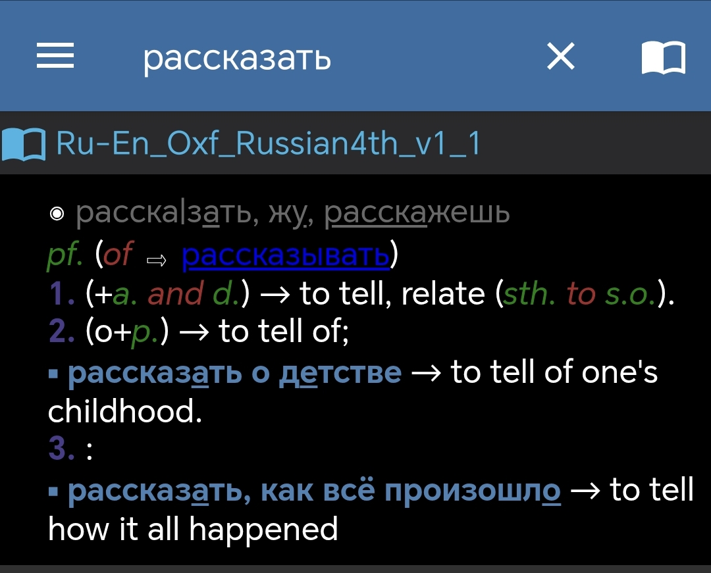
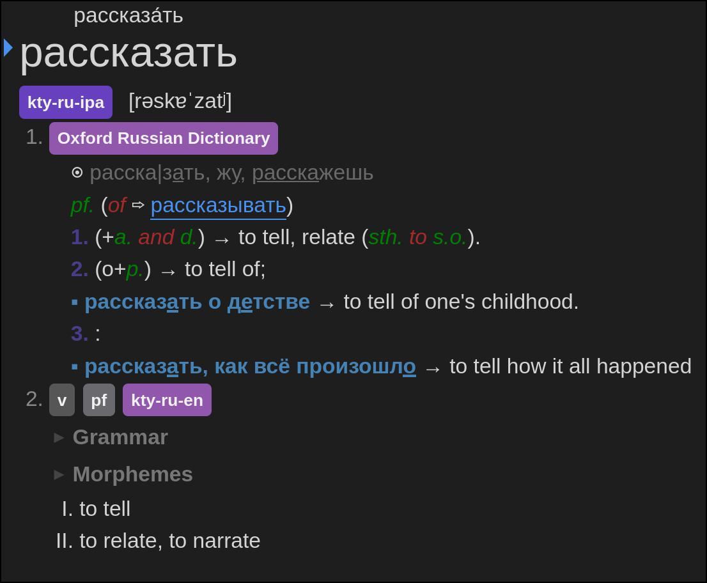

# Oxford Russian 4th for Yomitan

|  |  |
| :--------------------------: | :------------------------------: |
|            MDict             |             Yomitan              |

## Description

Although Wiktionary is a good dictionary with great coverage, it does not
include case government information ("рассказать" governs two cases, as shown in
the Oxford Russian Dictionary, but Wiktionary lacks this detail).

Also, the Oxford Russian Dictionary provides more detailed and better example
sentences, whereas Wiktionary's examples are inconsistent in quality.

## Usage

Run `1.py` to generate the `term_bank_1.json` file, then use

```sh
zip test.zip index.json term_bank_1.json
```

to create the `test.zip` file for importing into Yomitan.

(_Note._ You can directly use the generated `test.zip` file.)

## Source

The mdict file is from
[FreeMdict Cloud](https://cloud.freemdict.com/index.php/s/pgKcDcbSDTCzXCs), and
the txt file is converted using `pyglossary`. The python script is written 100%
by DeepSeek 🤖!
